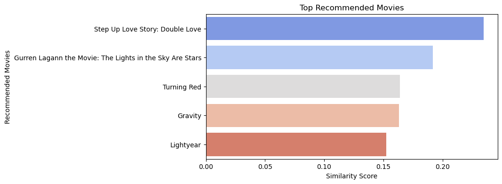

# Movie Recommender System

A content-based movie recommendation system using TF-IDF and cosine similarity based on IMDB movie descriptions.

## Dataset
The system uses the .

### Dataset Information
- **Source**: Kaggle
- **Size**: 9000+ movies
- **Key Features**: Movie names, overview, genre, crew, budget, revenue, ratings
- **Download**: 
  1. Visit the Kaggle dataset link
  2. Download 'imdb_movies.csv'
  3. Place in project root directory

### Dataset Columns Used
- `names`: Movie titles
- `overview`: Movie plot descriptions
- Additional columns available for potential feature enhancement:
   -`names`
   -`date_x`
   -`score` 
   -`genre`
   -`overview`
   -`crew`
   -`orig_title`
   -`status`
   -`orig_lang`
   -`budget_x`
   -`revenue`
   -`country`

## Setup
### Requirements
- Python 3.8+
- pip
- Kaggle account (for dataset download)

### Installation
1. Create and activate a virtual environment:
```bash
python3 -m venv venv
```
2. Activate the Virtual Environment:
- On Windows:
```bash
   .\venv\Scripts\activate
```
- On macOS/Linux:
```bash
   source venv/bin/activate
```

2. Install dependencies:
```bash
pip install -r requirements.txt
```

### Requirements.txt
```
pandas
numpy
matplotlib
seaborn
nltk
scikit-learn
```

## Running the System
1. Ensure 'imdb_movies.csv' is in your project directory
2. Run the recommendation system:
```bash
python3 Manjunath_Popuri_Movie_Recomendation_Task.py
```
3. Enter your movie preferences when prompted

## Sample Output

Input: 
```
"I like thrilling action movies set in space"
```

Output:
```
Top Recommendations:

1. Step Up Love Story: Double Love
   after three year of marriage and a bit more knowhow about sex this bumbling couple seem set but when jealousy set in the real trial of love begin


2. Gurren Lagann the Movie: The Lights in the Sky Are Stars
   seven year after the defeat of the spiral king simon and the dai gurren brigade must set out to the vastness of space to defeat a new threat and save the universe


3. Turning Red
   thirteen year old mei is experiencing the awkwardness of being a teenager with a twist when she get too excited she transforms into a giant red panda


4. Gravity
   dr ryan stone a brilliant medical engineer on her first shuttle mission with veteran astronaut matt kowalsky in command of his last flight before retiring but on a seemingly routine spacewalk disaster strike the shuttle is destroyed leaving stone and kowalsky completely alone tethered to nothing but each other and spiraling out into the blackness of space the deafening silence tell them they have lost any link to earth and any chance for rescue a fear turn to panic every gulp of air eats away at what little oxygen is left but the only way home may be to go further out into the terrifying expanse of space


5. Lightyear
   legendary space ranger buzz lightyear embarks on an intergalactic adventure alongside a group of ambitious recruit and his robot companion sox

```

## Code Structure
- `recommend.py`: Main script containing recommendation system
- Key functions:
  - `load_data()`: Loads and preprocesses the IMDB dataset
  - `preprocess_text()`: Cleans and normalizes movie descriptions
  - `build_tfidf_matrix()`: Creates TF-IDF vectors from text
  - `recommend_items()`: Generates recommendations based on user input

## Visualization
The system includes a visualization component that shows:
- Bar plot of similarity scores
- Top recommended movies


